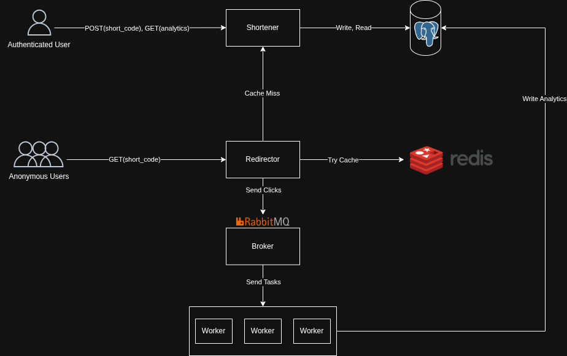

# Tiny Link Analytics

> **Status: Work in Progress** — Only the Shortener service is near completion. The Redirector, caching layer, message broker, and analytics workers are planned and under active development. See the [Project Status](#project-status) section for details.

A URL shortener with click analytics, built as a microservices system in .NET. The project explores distributed architecture patterns — event-driven communication, caching, asynchronous processing — applied end-to-end in a domain small enough to reason about, but with real justification for the split.

---

## Why Microservices?

A URL shortener doesn't strictly require microservices — a well-built monolith would handle the load just fine. The decomposition here is **intentional** and serves as a sandbox for studying distributed systems patterns (service boundaries, message brokers, eventual consistency, read-through caching) in a context where the trade-offs become tangible.

That said, the chosen split has genuine architectural merit:

- **Write-heavy vs. read-heavy paths.** The Shortener handles authenticated writes (link creation) and analytics queries. The Redirector handles the hot, anonymous read path (URL resolution). Separating them allows independent scaling and keeps authentication concerns off the latency-critical redirect.
- **Asynchronous analytics.** Click tracking is fire-and-forget by nature. Decoupling it through a message broker means the Redirector never blocks on analytics persistence — the redirect stays fast even if downstream processing is slow or temporarily unavailable.

---

## Architecture



### Services

**Shortener** — ASP.NET Core Web API
- Authenticated REST API for creating short codes and retrieving analytics
- Reads and writes link metadata directly to PostgreSQL
- Acts as the source of truth when the Redirector hits a cache miss

**Redirector** — ASP.NET Core Web API
- Public, anonymous endpoint that resolves `short_code → original_url`
- Read-through cache pattern: queries Redis first, falls back to the Shortener on cache miss
- Publishes click events to RabbitMQ in a non-blocking fashion

**Analytics Workers**
- Consume click events from RabbitMQ
- Aggregate and persist analytics data to PostgreSQL
- Designed to be horizontally scalable

### Infrastructure

| Component | Role |
|---|---|
| PostgreSQL | Primary store — links, users, analytics |
| Redis | Read-through cache for `short_code → URL` resolution |
| RabbitMQ | Event broker between the Redirector and the Analytics Workers |

---

## Tech Stack

- **.NET 10 / ASP.NET Core** — REST APIs (Shortener, Redirector)
- **Entity Framework Core** — ORM and migrations
- **PostgreSQL** — relational data store
- **Redis** — caching layer
- **RabbitMQ** — message broker for asynchronous click events
- **Docker / docker-compose** — local orchestration of services and infrastructure

---

## Project Status

| Component | Status |
|---|---|
| Shortener service | 🟢 Near completion — core endpoints implemented |
| JWT authentication | 🟡 In progress |
| Redirector service | 🔴 Planned |
| Redis caching layer | 🔴 Planned |
| RabbitMQ integration | 🔴 Planned |
| Analytics workers | 🔴 Planned |
| docker-compose orchestration | 🔴 Planned |
| Integration tests | 🔴 Planned |

---

## Getting Started

> Full orchestration of all services via `docker-compose` is supported. 

### Prerequisites

- .NET 10 SDK
- PostgreSQL 15+ (local instance or container)
- Docker (optional, for running PostgreSQL locally)


## Roadmap

1. **Finalize the Shortener service** — input validation, error handling, unit tests
2. **JWT authentication** — protect link creation and analytics endpoints
3. **Redirector service** — implement the redirect path with Redis read-through caching
4. **RabbitMQ integration** — publish click events from the Redirector
5. **Analytics Workers** — consume click events and persist aggregated analytics
6. **Integration tests** — cover the end-to-end flow across services

---

## Repository Structure

```
tiny-link-analytics/
├── docs/                 # Architecture diagrams and design notes
├── src/
│   ├── Shortener/        # Authenticated API for link creation and analytics
│   ├── Redirector/       # Public redirect service (planned)
│   └── Workers/          # Analytics consumers (planned)
├── docker-compose.yml    # Local orchestration (planned)
└── README.md
```

---

*This project is part of an ongoing study of distributed systems patterns in .NET.*
